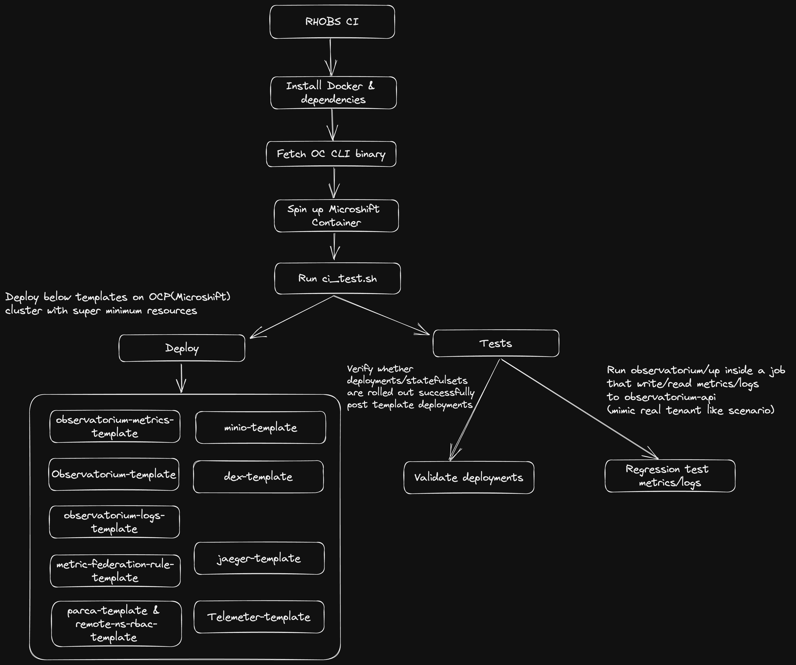

# RHOBS CI

## Introduction
This document provides an overview of the CI implementation that has been set up for this repository and running via [CircleCI](https://app.circleci.com/pipelines/github/rhobs/configuration). This CI validates the OpenShift specific templates by deploying them and running `observatorium-up` tests to ensure that in/out works fine.

## Design

## Implementation Details
* Microshift is used as a light-weight alternative to standard OpenShift Kubernetes.
* CircleCI has been chosen as the CI/CD platform to support the resource requirement to deploy complete RHOBS stack.
* `observatorium/up` is used for read/write metrics/logs onto deployed stack for testing.
* External objects dependicies like secrets and service accounts is replaced by manifests in the `test` directory.
* [Red Hat External SSO](https://sso.redhat.com/auth/realms/redhat-external) which serves as an OIDC provider is replaced by a local installation of [dex](https://dexidp.io/).
* The object storage normally provided by S3 is replaced by a local installation of [minio](https://min.io/).
* Some template parameters are overriden in order to make the deployments suitable for CI like:
  * CPU requests/limit, Memory request/limits and PVC storage are decreased so that RHOBS can be deployed on smaller clusters.
  * Number of replicas for components is decreased as well in order for the deployment to not be too resource heavy.
  * Objects names like service accounts, storage classes, secrets are replaced to work with local environment.
  > :bulb: **Tip:** These parameters can be edited accordingly as per the requirements.

## Build Process
* Whenever new code is pushed or new PR is created to rhobs/configuration CircleCI is triggered to build and test the manifests.
* The CircleCI [configuration file](https://github.com/rhobs/configuration/blob/main/.circleci/config.yml) consist of steps to be followed as per the design.
* [ci_test.sh](https://github.com/rhobs/configuration/blob/main/tests/ci/ci_test.sh) takes care of deploying the manifests and running tests
## Limitations
* Since some template parameters are overriden in order to make deployment smooth the CI cannot do a sanity of those paramters. For e.g defining 4Gi in cpu request and "4" memory request.
## Additional Information
To run `ci_test.sh` script locally:
* Install docker desktop or podman on local machine.
* Make sure that: 
  * In case of podman the machine should be created with minimum 4CPUs, 16GB Memory.
  * In case of docker the resources should be set to minimum 4CPUs, 16GB Memory.